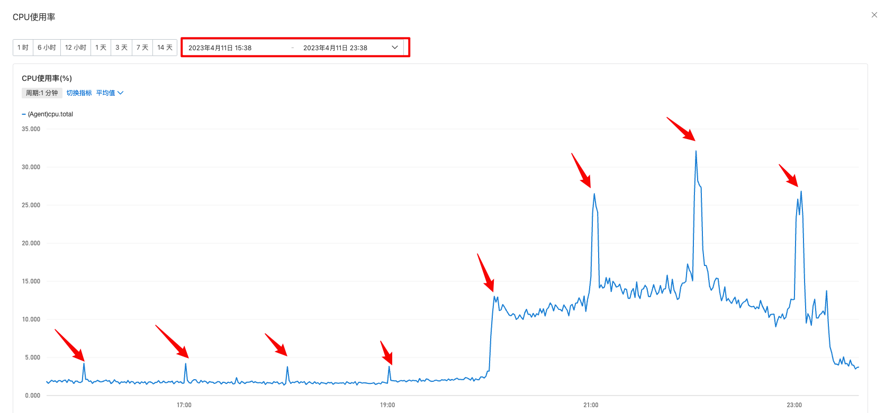

## 1. 专业技能

- 响应式 IO 模型；
- SPI 机制，以及其在 Motan 中怎么用的；
- 线程池；
- AQS；
- Netty 的事件驱动机制和内存管理；
- RocketMQ；
- 满查询优化，索引原理，事务，mvcc；
- redis，大key热key，持久化，部署架构；
- JVM；

## 2. 自我介绍

我叫 XXX，来自湖北黄冈。

我到目前已经有 3 年多的 Java 后端开发经验了，做过的也都是高并发、大数据量的服务。

目前在这家公司已经有两年多的时间了，平时的工作主要是 owner 一些需求，跟进需求的进度，并持续推动。从需求评审、设计评审、分配任务、编码设计、CR 等一些列流程下来，保证服务按时交付。工作中的一些碎片化的时间会利用起来去梳理当前我负责的服务上的现有逻辑，找出一些性能和逻辑漏洞等问题并推动解决。

平时下班后的时间会学习一些开源框架的源码设计，目前我已经看了 Netty、RocketMQ、JUC、Spring、Mybatis 的核心源码了，学习这些框架的目的是为了从中也学会不少设计模式的使用，和一些架构、设计思路，从而更好的运用在项目中。

## 3. 你做了什么？你扮演什么样的角色？

刚开始进来的时候就是做一些普通的开发，也就是说需求并不是我 Owner，其实就是顺带熟悉一下项目把。

过了大半年后，项目熟悉了，一些需求就由我来 owner 了，主要体现在：需求评审、设计评审、分配任务、编码设计、Code Review 等都由我来负责，跨部门沟通，推动整个需求并按时交付。

其余时间，会梳理现有的服务的逻辑，找出其中出现的性能问题或者逻辑漏洞，并推动优化解决这些问题。

## 4. 项目个人价值体现

### 4.1. IM 系统设计

#### 4.1.1. 技术选型

```
Kafka,Redis,Netty,Hystrix,Nacos,Motan,Springboot
```

#### 4.1.2. 功能设计

**消息优先级**

1. 时实性(如礼物消息要求快速到达，不能丢)
2. 限流丢弃(如文本消息 在超过一定频次后可以丢消息)

**QOS**

1. 至少到达1次(有可能重复)
2. 至多到达1次(有可能丢消息)
3. 必达1次(不能重复)

**有限时效实时消息(有效期内到达，否则丢弃，不落地=如点赞)**    

**敏感词检查(是否进行敏感词检查，如点赞/系统消息就不需要检查，评论消息必须检查)**


**群消息(群聊/聊天室)**

1. 直播间人数无上限
2. 直播间在线人数- >支持查询用户在线状态
3. 直播间成员->支持查询在线直播间用户列表(->这个在业务上去做)
4. 消息内容(业务级定义:文本/点赞/礼物/离线消息->这个目前业务进直播间有拉历史消息)
5. 支持游客态查询消息(游客态)


**C2C消息(单聊)**

支持用户与用户之间互发消息(目前消息类型有:拉黑/增删管理员/PK和连麦发起)


**支持环境**(语言)

1. Android(Java)
2. iOS(ObjectC/Swift)
3. PC(C++)
4. WEB/H5(JS)


**多端支持**

1. 多端登陆
2. 多端消息同步(主要需求是主播多端操作的消息同步)


**服务端需求**

1. 消息回调
   1.    文本消息
   2.    礼物
   3.    点赞
2. 弹性伸缩
3. 故障转移
4. 降级
5. 监控
6. 消息染色/路径跟踪
7. 消息日志
8. 到达率(统计?)

#### 4.1.3. 消息存储模型

消息存储模型，存储模型的选型直接影响着消息同步模块的实现。消息、会话、会话与消息组织关系的实现方式在业界各主流IM系统中都不尽相同，但无外乎两种形式：写扩散读聚合、读扩散写聚合。读、写扩散是消息在群组会话中的存储形式，其详细说明如下。


- **在读扩散场景中，消息归属于会话，相当于数据库中存储着一张conversation_message表，其中包含该会话产生的所有消息。这种存储形式的好处是消息入库效率高，只保存会话与消息的绑定关系即可。**
- 在写扩散场景中，会话产生的消息投递到message_inbox表中，该表类似于个人邮件的收件箱，其中保存着个人的所有会话，会话中的消息按其产生的时间顺序排列。这种存储形式的好处是能实现灵活的消息状态管理，会话中的每条消息在面向不同的接收者时可以呈现出不同的状态。

**读扩散和写扩散的优缺点：**

- **采用读扩散的方式，在大并发修改数据的场景下，数据一致性处理效率和数据变更效率会成为系统性能瓶颈。**
- 采用写扩散的方式实现消息存储模型，以更高的存储成本支持更高的更新性能。

**我们系统怎么实现的呢？**

- IM 系统并不做真正存储的操作，在业务服务器会提供消息真正发送前后发送后的 callback 服务；
- 在 callback 服务中去做参数校验、落库、消息箱通知、push 等逻辑；

#### 4.1.4. 系统整体架构


#### 4.1.5. 认证 token 设计

| 版本号(2位) | uid(12位) | `appId(4位)` | `tick(登陆计数器)(3位)` | `clientId(客户端类型)(1位)` | uidtype(用户类型)（1位） | 随机字符(8位) | ` 加密串(6位)` |
| :---------- | :-------- | :----------- | :---------------------- | :-------------------------- | :----------------------- | :------------ | :------------- |
| 0-2         | `2-14`    | `14-18`      | `18-21   `              | `21-22`                     | `22-23`                  | `23-31`       | `31-37`        |


IM 系统接入流程

**从 KilaServer 拿 access_token(1) -> 调用 dispatch -> 获取长连接地址:端口和 access_token(2) -> 长连接登录(进入直播间) ->轮询(收发消息)**

#### 4.1.6. 协议设计

主要包括请求头和请求体了

请求头就是一堆 key，value，比如：

- token
- requestid
- 机型，安卓或者iOS
- appid
- 请求消息的类型，是群发，单发，获取长连接等类型；

对应请求体：

- 不同的类型的协议的，需要携带的请求提的 key，value 不一样；

#### 4.1.7. probuf 序列化

不是我做的，不看了

#### 4.1.8. ACK 机制

并不是所有消息都需要进行 ACK，一些重要的消息进行 ACK，重要的消息给客户端返回一个需要响应 ACK 的标记，客户端接收到消息后就会发送一个 ACK 消息到 IM 系统。

经过线上验证 IM 系统的消息到达率 99.9%

#### 4.1.9. 压测数据参考

1. api-server(收发消息服务层，登录session，房间成员、关系/消息收发消息等业务处理) 
2. api-exchange(第三方消息回调，包含腾讯/微博的回调以及回调给KilaServer的消息)
3. center-connect (上行发消息，称短连接)
4. api-connect(下行收消息，称长连接) 

下行(收消息)

压测环境 阿里云ECS 16核 32G 专用网络 最大100M，redis(pub/sub 4台 1G 4.0高配2W连接数)

api-sever 1台(192.168.5.55)， api-connect 1台(192.168.5.34)，center-connect 1台 独立机(192.168.5.35)，redis(pub/sub 4台 1G 4.0高配2W连接数)：

1. 单台ECS 空消息情况下 TCP连接数峰值2.5W (由于测试客户端限制，还没有达到最大值，预估3W左右）
2. 单台ECS 空消息 WebSocket连接数峰值2W (由于测试客户端限制，还没有达到最大值，预估2.5W左右）
3. 有消息收发的情况下，连接数预估1W左右，因为消息会占用很大的网络流量(微博的机器是按照单实例1W的连接分布)

#### 4.1.10. IM 系统部署

- 长连接：41 台，按一台抗 1w 长连接，抗 40w 用户同时在线轻轻松松；
- 短连接：6 台；
- 群组服务：6 台；
- thirdparty 第三方：3 台；
- service 核心服务：6 台；

### 4.2. IM 系统公网流量降低

#### 4.2.1. 消息上行限流 Redis

使用『 lua 脚本 + 本地缓存』的设计思路，提前将 lua 脚本加载 sript load 加载到 redis 中返回一个 sha。

> 需要注意的是：如果执行 lua 的时候异常了，会返回 NOSCRIPT No matching script. Please use EVAL.    这时候需要将 lua 脚本重新 script load 到 redis 上。所以说需要有重试机制和 try catch 防止 lua 执行失败。

整体流程如下：

- 房间维度下的消息类型维度，两个维度。


脚本如下：

```lua
-- 限流的 key，对应业务的消息类型
local rate_limit_key = KEYS[1]
-- 限流时间，单位为秒，为0表示不限制
local rate_limit_period = KEYS[2]
-- 限流时间内可以推送的最大的上行消息数
local rate_limit_max = KEYS[3]
local current_old = redis.call('get', rate_limit_key)
if current_old and (tonumber(current_old) >= tonumber(rate_limit_max)) then
    -- 说明已经到了时间窗口内的最大上行消息数了，需要返回 pttl 时间给业务程序
    -- 业务程序
    local p_ttl = redis.call('pttl', rate_limit_key)
    return "0," .. tostring(p_ttl)
end
local current
current = redis.call('incr', rate_limit_key)
if tonumber(current) == 1 then
    -- 第一次调用 incr 时，给限流 key 设置过期时间，其实这个就是限流的时间窗口
    redis.call('pexpire', rate_limit_key, rate_limit_period)
end
return "1"
```

#### 4.2.2. 消息下行限流

消息下行限流策略

- 限制房间内的消息下行，房间维度。
- 主要策略就是：根据直播间在线人数来进行限流，例如 5000 人，下发 80%，10000 人下发 60% 等等；
- 由于弹幕刷新很快，所以用户实际无感知，而且提升了用户体验；


具体策略：

- 根据房间人数的维度进行限流，不同的消息类型的限流比例不一样。
- 多个消息之间有关联的需要保证限流后，这一批消息接收到人全部接收到，没收到的一个消息都不允许收到；
  - 例如礼物连接消息，需要保证看到连击的用户全部看到，没看到连击的用户一个都不允许看到；
  - 具体实现就是以用户的 uid 按 100 来取模，一批关联消息中会有一个相同的 ID，根据这个 ID 的值做随机，使得在限流范围内的用户能够看到；
  - eg.  一批关联消息中有个字段是 id，比如尾号是 35，如果消息的限流比例是 30%，那么能够接收的消息的范围是 35 到 (35 + 30 = 65) 之间，也就是说 uid 按 100 取模后命中了 [35, 65] 时，就会下发消息。直播间内用户比较多的时候用户 uid 的尾号的分布比较均匀。

#### 4.2.3. 消息精简

- 历史消息中，有些字段是冗余字段，有些字段端上并不需要，这种字段就可以砍掉了；
- 有些字段没有做简化，给该字段做简化处理。例如 name 可以简化为 n；

#### 4.2.4. 消息拆分

在刚开始的时候一个 IM 的消息类型可能数据量并不大，随着需求迭代，一个类型的消息每次下发的数据就比较臃肿了。

在实际开发中我们有个消息是直播间每秒都会下发的，但是其中有些数据一秒其实并不会有变化，可能要好几秒才会改变，这样有部分数据就会每次下发都是相同的。

解决方案：

- 数据按照更新频率进行分割，将低频率的消息拆分到一个新的消息类型中。

#### 4.2.5. 公网流量降低效果

**以下数据并不是项目中真实数据，但是数据变化大概是按照一定的比例展示的**

|                                    | 日期/月 | 日均流量（GB） | 日均费用（元） | 日均下行弹幕数(亿) |
| ---------------------------------- | :------ | :------------- | :------------- | :----------------- |
|                                    | 2023-01 | 3400           | 1600           | 100                |
| 客户端优化<br />消息精简、消息拆分 | 2023-02 | 2800           | 1400           | 90                 |
|                                    | 2023-03 | 2400           | 1200           | 80                 |
| 3 月底上线下行限流                 | 2023-04 | 1400           | 800            | 50                 |
|                                    | 2023-05 | 1500           | 800            | 50                 |
|                                    | 2023-06 | 1800           | 900            | 50                 |

### 4.3. IM 长连接优化

#### 4.3.1. 背景

- 背景：运营活动、大主播开播，经常导致 im 服务器 cpu 利用率暴涨到 90%，导致消息延迟或者丢失，影响用户体验
- 优化目标：在相同并发的情况下，cpu 利用率下降 20%；

优化方向：

| 优化点       | 现状                                                         | 优化措施                                                     |
| :----------- | :----------------------------------------------------------- | :----------------------------------------------------------- |
| 消息处理逻辑 | 1、每条消息下发到用户，在用户pipline都做一次编码2、循环体内逻辑负载 | 1、直播间里用户都共享一份消息，无需每个用户的channel都做编码，将编码提前至下发前<br />2、循环体内尽量少做业务 |
| 线程池       | pushthreadPool 100 //用途：下发push ，每天高峰期会丢消息，平均每个节点丢 100 条每天<br />BizThreadPool 5000 // 业务处理，登录、登出、心跳等，较空闲 <br />bossGroup 1 // netty监听线程 <br />workerGroup 24 // netty worker线程，编解码、读写数据，较繁忙 | Reactor io 模型，多级优化                                    |
| gzip         | 目前配置 4k 压缩，大部分消息在 1k 左右，达到压缩阈值很少     | 压缩阈值改为1k（压缩比40%左右）压缩会消耗cpu，流量减少提升流畅度，提升用户体验 |
| 堆外内存     | 目前写数据使用堆外内存，但如果发一条消息，直播间有1000个用户，会申请1000份内存 | 同一个房间的 chennel 共享一份数据                            |

#### 4.3.2. gzip 策略调整

目前线上数据压缩阈值设置为：4k， 经统计，大部分消息在1k左右，压缩策略基本不生效。

|        | 压缩策略     | 直播间人数 | 消息并发数 | cpu利用率 | 流量  |
| ------ | :----------- | :--------- | :--------- | :-------- | :---- |
| 修改前 | gzip阈值4096 | 2000       | 2.3w       | 84%       | 98M/s |
| 修改后 | gzip阈值1024 | 2000       | 3.1w       | 87%       | 66M/s |

#### 4.3.3. 编解码优化

以下为长连接服务火焰图，图中分为 4 大区域

1. channel flush部分
2. channel write部分
3. AsyncMsgHandler 部分，读取 redis 数据，写入 channel
4. EpollEventLoop.epollWait 事件循环


区域 2 中发现主要耗时在 WesyncProtocolEncoder.encode 方法，而 encode 方法中主要逻辑是对下发的数据进行protocol编码。

**通过review代码，发现同一个房间的channel下发的数据是完全一致的，没有必要在每个channel 做编码，可以把编码工作提前到下发之前，即在生成下发数据的时候就做好编码，这样在encode里就不需要编码（相当于把循环里的操作挪到循环外）**

优化效果

| 策略                                     | 房间人数 | 下发并发 | cpu利用率 | `WesyncProtocolEncoder.encode cpu占比` |
| :--------------------------------------- | :------- | :------- | :-------- | :------------------------------------- |
| `WesyncProtocolEncoder  有protocol 编码` | 4000     | 58000    | 370%      | `10.67%`                               |
| `WesyncProtocolEncoder  无protocol 编码` | 4000     | 58000    | 320%      | 1.49%                                  |

#### 4.3.4. 优化长连接日志打印

优化前的日志大小：

```
-rw-r--r-- 1 root root  853M Apr 12 21:03 connector-info.log.20230412-20.gz
-rw-r--r-- 1 root root  1.2G Apr 12 22:04 connector-info.log.20230412-21.gz
-rw-r--r-- 1 root root  1.1G Apr 12 23:04 connector-info.log.20230412-22.gz
-rw-r--r-- 1 root root  266M Apr 13 00:00 connector-info.log.20230412-23.gz
......
-rw-r--r-- 1 root root  903M Apr 13 21:03 connector-info.log.20230413-20.gz
-rw-r--r-- 1 root root  1.1G Apr 13 22:04 connector-info.log.20230413-21.gz
-rw-r--r-- 1 root root 1005M Apr 13 23:04 connector-info.log.20230413-22.gz
-rw-r--r-- 1 root root  339M Apr 14 00:01 connector-info.log.20230413-23.gz
```

优化后的日志大小

```
-rw-r--r-- 1 root root  264M Apr 15 20:59 connector-info.log.20230415-20.gz
-rw-r--r-- 1 root root  305M Apr 15 21:59 connector-info.log.20230415-21.gz
-rw-r--r-- 1 root root  310M Apr 15 22:59 connector-info.log.20230415-22.gz
-rw-r--r-- 1 root root  237M Apr 15 23:59 connector-info.log.20230415-23.gz
......
-rw-r--r-- 1 root root  226M Apr 16 20:59 connector-info.log.20230416-20.gz
-rw-r--r-- 1 root root  279M Apr 16 21:59 connector-info.log.20230416-21.gz
-rw-r--r-- 1 root root  277M Apr 16 22:59 connector-info.log.20230416-22.gz
-rw-r--r-- 1 root root  191M Apr 16 23:59 connector-info.log.20230416-23.gz
```

ps.因为日志压缩不再在 IM 项目里压缩，而是用脚本压缩。所以 CPU 峰刺平缓了有两个原因：

1. 运维写脚本压缩日志，不再用 IM 项目里的来压缩；
2. 删除长连接写数据循环里面的 info 日志；

以一台机器为例，整点时间压缩日志导致 CPU 飚高

 

脚本压缩日志和移除写循环 info 日志后，已经没有明显的峰刺了


### 4.4. 直播间多级缓存优化

#### 4.4.1. 突发流量多级缓存优化

背景：由于大主播开关播，用户同时进入直播间会有大量的接口调用，导致系统 QPS 激增，对系统的冲击比较大，为了应对突发流量，设计了直播间的多级缓存优化。

目前系统中有基本上所有数据都有 Redis 缓存层，但是 QPS 调用量大的接口里面可能需要查询各种各样的信息，导致接口的跨度比较大，可能会查询很多次 Redis 或者 DB。

比如接口需要返回一个 RoomStart 的对象，但是这个对象的数据组装来自很多个 service 的接口调用，考虑提前将数据组装好，将 RoomStart 对象存放到本地缓存和 Redis 中，就是一个镜像数据。（前提是这些数据的更新频率不高）

主要流程如下，两层缓存；

- 本地缓存：并为存储所有数据，而是存储上次刷新时间戳，实现定时刷新 Redis 缓存的目的；
- Redis 缓存：当本地缓存的刷新时间戳失效后，调用 Service 接口刷新 Redis 缓存；

#### 4.4.2. 本地缓存回种超时优化（异步刷新）

背景：礼物的数据更新的频率不高，使用本地缓存去存储，但是假如本地缓存过期回种的时候只会允许一个线程去刷新数据，其他线程就会等待，导致 RPC 超时，给用户不好的提示。

优化：针对礼物这种静态数据但请求量大的业务场景，通过异步刷新本地缓存 , 保证本地缓存的数据是最新的。

- 查询时先获取上次刷新的时间 , 如果到了需要刷新的时间仍然返回缓存中的结果, 同时启动异步刷新缓存的任务；
- 这样可以避免在用户请求线程中回种导致用户请求超时；
- 例如有些业务 比如查询主播自定义礼物单次从查询回种需要查询 1900+ 条数据回种必然超时可以使用这个工具类异步刷新本地缓存；

主要优化思路：

- 一个业务需要保存两个本地缓存的 key，一个实际数据和上次刷新时间；
- 如果从本地缓存没有获取到数据，那么还是要同步等待数据刷新；
- 如果从本地缓存获取到了数据，但是距离上次刷新时间已经到期了。此次会返回旧数据，然后异步刷新数据；

#### 4.4.3. 本地缓存的问题

问题：本地缓存会出现 「数据漂移」的现象。具体体现为集群中的多个服务中的本地缓存的刷新时机不一样，两台机器内的本地数据的不一样，用户两次请求分别打到了这两个机器上，导致用户看到的效果不同。

解决：无法解决，使用本地缓存的场景就是为了存储数据变更频率不高的场景，那么对这种数据不一致性是可以接受的。

### 4.5. 服务降级

#### 4.5.1. 背景

如果有 A 和 B 两个服务，A 调用 B 服务，如果 B 服务出现问题了，如果此时 A 还有大量的调用 B 的请求，就可能导致 A 也会出现问题，新来的请求导致线程数不断增加

#### 4.5.2. 解决方案

有两种隔离方案：

- **线程池隔离**：线程池隔离实际上就是对每个服务的远程调用单独开放线程池，比如服务A要调用服务B，那么只基于固定数量的线程池，这样即使在短时间内出现大量请求，由于没有线程可以分配，所以就不会导致资源耗尽了；
- **信号量隔离**：使用 Semaphore 类（许可证）实现的，思想基本上与上面是相同的，也是限定指定的线程数量能够同时进行服务调用，但是它相对于线程池隔离，开销会更小一些，使用效果同样优秀，也支持超时等。Sentinel也正是采用的这种方案实现隔离的。

当下游服务因为某种原因变得不可用或响应过慢时，上游服务为了保证自己整体服务的可用性，不再继续调用目标服务而是快速返回或是执行自己的替代方案，这便是服务降级。

Sentinel 中有三种策略：

- **慢调用比例**
- **异常比例**
- **异常数**

降级方法：`@SentinelResource`中配置`blockHandler`参数

#### 4.5.3. 降级处理

降级的原理就是降低次要功能的可用性实用性，增加核心功能的高可用性。

降级的种类：

1. 根据降级的种类可以分为 ①服务端代码开关降级；② 开关前置降级；
2. 根据读写性质可以分为 ① 读降级；② 写降级；
3. 根据降级的性质可以分为 ① 内容降级；②限流降级；
4. 根据维护降级可以分为 ① 手动降级 ②监控自动降级；


第一个分类：

- 服务端代码开关降级，就是一些配置开关，对于非核心的功能进行入口关闭或者返回的内容精简；
- 开关前置降级，可以把配置开关通过提供服务端的接口，返回给客户端一些配置开关信息，客户端哪里去做降级。或者可以在 Nginx 做降级处理，或者网关；

第二个分类：

- 读降级怎么做？比如礼物信息，一般是不会频繁改变的，本来是可以通过读 Redis + MySQL 的策略，在大流量情况下可以允许直接读取持久的 Redis 数据；
- 写降级怎么做？针对非核心业务，可以把直接写入 MySQL 的数据先临时保存起来。
  - 例如有很多插入一条数据的操作。
  - 可以把这些操作数据传到 Kafka，然后存到 redis，等到 redis 中的数据存到了 10 条，或者 100 条，就可以批量插入数据库了；

第三个分类：

- 内容降级：给返回的数据精简一下；
- 限流降级：通过一些算法进行限流；

第四个分类：

- 手动降级：是人为看到系统负载异常后，手动调整降级；
  - 主要是一些配置开关，可以直接去 Nacos 的网页改。因为 Nacos 可以通过服务端代码去修改配置的能力，可以通过调接口批量修改开关；
- 自动降级：是系统监测到异常后，自动降级，自动降级虽然更加智能，但有时候自动脚本可能会干一些超乎预料的事情。
  - 阿里云可以监控系统的 CPU 和内存等指标，当触发到某个阈值一段时间后可以去执行一些操作，比如发钉钉消息等，其实也可以去触发一些脚本，比如调用前面说的 Nacos 代码修改配置的接口；
  - 大多手动降级也可以做成自动的方式，可以根据各种系统指标设定合理阈值，在相应指标达到阈值上限自动开启降级。在很多场景下，由于业务过于复杂，需要参考的指标太多，自动降级实现起来难度会比较大，而且也很容易出错。
  - 但是这种可能某些无关紧要的异常导致的指标异常，这时去触发服务降级，可能会给用户带来不好的体验；

### 4.6. 国际版迁移

没啥好说的，就是重构一下代码，数据隔离兼容多 app，为后续新建 app 缩短时间。

### 4.7. Redis 相关

#### 4.7.1. 什么是大 key？

通常以Key的大小和Key中成员的数量来综合判定，例如：

- **Key 本身的数据量过大**：一个 String 类型的 Key，它的值为5 MB。
- **Key 中的成员数过多**：一个 ZSET 类型的 Key，它的成员数量为10,000个。
- **Key 中成员的数据量过大**：一个 Hash 类型的 Key，它的成员数量虽然只有 1,000 个但这些成员的 Value（值）总大小为100 MB。

#### 4.7.2. 什么是热 key？

通常以其接收到的 Key 被请求频率来判定，例如：

- **QPS 集中在特定的 Key**：Redis 实例的总 QPS（每秒查询率）为 10,000，而其中一个 Key 的每秒访问量达到了 7,000。
- **带宽使用率集中在特定的 Key**：对一个拥有上千个成员且总大小为 1 MB的 HASH Key 每秒发送大量的 **HGETALL** 操作请求。
- **CPU 使用时间占比集中在特定的 Key**：对一个拥有数万个成员的 Key（ZSET类型）每秒发送大量的 **ZRANGE** 操作请求。

> 这个发生过一个问题，有个 for 循环去查 zset 的 zrange，导致这个 key 的 CPU 的使用时间占比比较集中。

#### 4.7.3. 大 key 引发的问题？

- 客户端**执行命令的时长变慢**；
- Redis 内存达到 **maxmemory** 参数定义的**上限引发操作阻塞或重要的 Key 被逐出**，甚至引发内存溢出（Out Of Memory）；
- 集群架构下，某个数据分片的内存使用率远超其他数据分片，**无法使数据分片的内存资源达到均衡**；
- 对大 Key 执行**读请求，会使 Redis 实例的带宽使用率被占满，导致自身服务变慢，同时易波及相关的服务**；
- 对大 Key 执行**删除操作，易造成主库较长时间的阻塞**，进而可能引发同步中断或主从切换；

#### 4.7.4. 热 key 引发的问题？

- **占用大量的 CPU 资源，影响其他请求并导致整体性能降低**。
- **集群架构**下，产生访问倾斜，即**某个数据分片被大量访问，而其他数据分片处于空闲状态，可能引起该数据分片的连接数被耗尽，新的连接建立请求被拒绝等问题。**
- 在抢购或秒杀场景下，可能因商品对应库存 Key 的请求量过大，超出 Redis 处理能力造成超卖。
- 热 Key 的请求压力数量超出 Redis 的承受能力易造成缓存击穿，即大量请求将被直接指向后端的存储层，导致存储访问量激增甚至宕机，从而影响其他业务。

#### 4.7.5. 为什么会出现热 key 和大 key 呢？

未正确使用Redis、业务规划不足、无效数据的堆积、访问量突增等都会产生大Key与热Key，如：

- 大key
  - 在不适用的场景下使用 Redis，易造成 Key 的 value 过大，如使用String类型的Key存放大体积二进制文件型数据；
  - **业务上线前规划设计不足，没有对 Key 中的成员进行合理的拆分，造成个别 Key 中的成员数量过多；**
  - **未定期清理无效数据，造成如 HASH 类型 Key 中的成员持续不断地增加；**
  - **使用 LIST 类型 Key 的业务消费侧发**生代码故障，造成对应 Key 的成员只增不减。
- 热key
  - 预期外的访问量陡增，如突然出现的爆款商品、访问量暴涨的热点新闻、直播间某主播搞活动带来的大量刷屏点赞、游戏中某区域发生多个工会之间的战斗涉及大量玩家等。

#### 4.7.6. 如何定位大 key 和热 key？

- **我们公司用的阿里云的云 Redis，里面有分析大 key 和热 key 的工具；**
- 也可以自己将内存中的 RDB 文件备份一下，然后去一些分析工具中分析，比如开源的 **rdr，或者 redis-rdb-tools** 可以分析那个 key 的占用比较大；
- 通过 **redis-cli** 的 **bigkeys** 和 **hotkeys** 参数查找大 Key 和热 Key；（比较局限性）
- 通过**MONITOR**命令找出热Key。Redis的**MONITOR**命令能够忠实地打印Redis中的所有请求，包括时间信息、Client信息、命令以及Key信息。在发生紧急情况时，可以通过短暂执行**MONITOR**命令并将返回信息输入至文件，在关闭**MONITOR**命令后，对文件中请求进行归类分析，找出这段时间中的热Key。**说明** 由于**MONITOR**命令对Redis实例性能消耗较大，非特殊情况不推荐使用**MONITOR**命令。

#### 4.7.7. 如何优化大 key 呢？

- **对大Key进行拆分**

  例如将含有数万成员的一个HASH Key拆分为多个HASH Key，并确保每个Key的成员数量在合理范围。在Redis集群架构中，拆分大Key能对数据分片间的内存平衡起到显著作用。

  一般情况下大 key 是 set 或者 zset。比如我们线上有一个存储主播工会名称的 zset，存的是 uid 和 工会名称。这时我们就可以按照 uid 去取模分为 100 个 key，将一个大的 zset 拆分为 100 个小的 key；

- **如果是 hash 中的 value 比较大的话，就需要考虑将 hash 中的每个value 拆分成 string 了；**

#### 4.7.8. 如何处理热 key 呢？

- **临时修改代码**，临时解决问题
  - 如果是 Redis 主从架构，将这个热 key 同时分布到多个 redis，使用轮询的方式访问多个 Redis，分担压力；
  - 如果是 Redis 集群架构，将这个热 key，该几个名字让他均匀分布在多个分片上，各分片同时分担压力；

- **redis 上读写分类部署架构；**
  - 如果热 Key 的产生来自于读请求，您可以将实例改造成读写分离架构来降低每个数据分片的读请求压力，甚至可以不断地增加从节点。缺点是对运维带来挑战；
  - 读写分离架构同样存在缺点，在请求量极大的场景下，读写分离架构会产生不可避免的延迟，此时会有读取到脏数据的问题。因此，在读、写压力都较大且对数据一致性要求很高的场景下，读写分离架构并不是最优方案；


#### 4.7.9. Redis 集群数据倾斜问题

- 在 Redis 集群中，如果**个别数据分片节点**的**内存使用率**或 **CPU 使用率**、**带宽使用率**、**延时**等性能指标远远高于其他数据分片，该 Redis 集群可能已产生数据倾斜。**数据倾斜严重时，会导致实例在整体内存使用率不高的情况下，发生内存逐出（Key eviction）、内存溢出OOM（Out Of Memory）、实例响应时间上升等异常情况。**
- Redis 集群架构作为一个分布式系统，整个数据库空间会被分为 16384 个槽（Slot），每个数据分片节点将存储与处理指定 Slot 的数据（Key），例如 3 分片集群实例，3 个分片分别负责的Slot为：[0,5460]、[5461,10922]、[10923,16383]。当用户写入或更新数据时，客户端会通过 CRC 算法计算出 Key 所属的 Slot，具体公式为 `Slot=CRC16(key)%16384`，并将数据写入 Slot 所属的数据分片节点。通常情况下，各数据分片节点的 Key 数量是均匀分布的，同时内存使用率、CPU 使用率等性能指标也是相近的；
- 通常情况下，若**某数据分片节点（最高）的性能指标高出其他数据分片节点（最低）20%及以上时，可认为已产生数据倾斜，差值越大，数据倾斜程度越严重。**
- 数据倾斜类型：
  - **QPS 指标：数据访问倾斜，**会导致该Key所在的数据分片节点CPU使用率、带宽使用率升高，从而影响该分片上所有Key的处理。
  - **内存指标：内存倾斜**，会导致该Key所在的数据分片节点的内存使用率、带宽使用率升高，从而影响该分片上所有Key的处理。

- 影响的情况主要是：
  - **内存倾斜：大 key；**
  - **带宽倾斜：热 key、高消耗的命令，比如 hgetall 等；**
  - **CPU 使用率倾斜：热 key、高消耗的命令，比如 hgetall 等；**

- 如何解决集群数据倾斜：
  - 大 key：拆分大 key；
  - 热 key：避免使用热 key；
  - 高消耗命令：例如 hgetall，zrange 0 -1;
  - 尽量避免使用 hash tag；若Key名称中包含`{}`，例如`{item}id1`，则Tair仅会对`{}`中的内容进行Slot计算并选择数据分片节点。Key均会被分配至同一数据分片节点，导致该数据分片节点的内存资源、性能消耗大幅升高。


#### 4.7.10. Redis CPU 过高问题

当平均CPU使用率高于50%、连续5分钟内的CPU平均峰值使用率高于90%时，需要及时关注并排查该问题，以保障应用的稳定运行。

1. **禁用高消耗命令**（即时间复杂度为O(N)或更高的命令）：例如 **KEYS**， hgetall，zrange 0 -1，怎么定位，慢查询记录。
2. **优化业务**，例如**避免频繁执行数据排序操作**。
3. 优化热点 Key；
4. 优化短连接：**频繁地建立连接，导致Redis实例的大量资源消耗在连接处理上。具体表现为CPU使用率较高，连接数较高，但QPS（每秒访问次数）未达到预期的情况。**解决方法：将短连接调整为长连接，例如使用JedisPool连接池连接。
5. 经过上述方法优化后，在业务正常运行的情况下，还是经常遇到实例整体的负载较高（平均CPU使用率在50%以上），可能存在性能瓶颈。

#### 4.7.11. Redis 内存使用率过高问题

当**内存不足时，可能导致 Key 频繁被逐出、响应时间上升、QPS（每秒访问次数）不稳定，命中率不高**等问题，进而影响业务运行。通常情况下，当内存使用率超过95%时需要及时关注。

- 查询**历史累计逐出的 Key 总数**和命令的最大时延，分析是否呈现明显的上升趋势。
- 当Redis的内存使用率不符合预期时，分析内存占用；

优化内存使用率：

- 查询现有的 Key 是否符合业务预期，及时清理无用的Key；
- 分析大Key分布；
- 根据业务需求，设置合理的过期 Key 主动删除的执行频率（即调整**hz**参数的值）
- 可能有性能瓶颈，升级去；

####  4.7.12. Redis 使用流量过高问题

- 通常来说，流量的平均使用率持续保持在80%时需引起注意，可能流量不足。
- 调整实例的带宽，降低对业务的影响并获得较长的时间窗口来排查问题。
- 当业务的访问量与预期带宽消耗不匹配，例如流量使用率的增长趋势和 QPS 的增长趋势明显不一致。可以通过缓存分析功能，发现实例中存在的大 Key。对大 Key（通常大于 10 KB）进行优化，例如将大 Key 拆分、减少对大 Key 的访问、删除不必要的大 Key 等。
- 如果都正常，说明可能实例存在性能瓶颈，需要考虑升级内存大小；

#### 4.7.13. Redis 重要的配置

| 配置项                                                       |                                                              |                  |
| ------------------------------------------------------------ | ------------------------------------------------------------ | ---------------- |
| **appendfsync**                                              | AOF（AppendOnly File）持久化功能的fsync频率<br />仅在**appendonly**参数开启时生效，<br />默认为 everysec |                  |
| **appendonly**                                               | 开启或关闭主节点的 AOF 持久化功能，可选值： <br /> yes：默认值，开启 AOF 持久化。<br /> no：关闭 AOF 持久化。 |                  |
| **dynamic-hz**                                               | 开启或关闭动态hz，可选值：  yes：默认值，开启。 no：关闭。   | 高版本才有       |
| **hash-max-ziplist-entries**<br />**hash-max-ziplist-value** | 当哈希对象同时满足以下两个条件时， 使用ziplist编码。<br />1、哈希对象保存的键值对数量小于**hash-max-ziplist-entries**的值。<br />2、 哈希对象保存的所有键值对的键和值的字符串长度的字节数都小于**hash-max-ziplist-value**的值。 | Redis 6 一下版本 |
| **hz**                                                       | 设置 Redis 后台任务执行频率，例如清除过期键任务。取值范围为 1~500，默认值为 10，即每秒执行 10 次。<br />该值越大，CPU资源消耗越多，但在过期键较多的情况下清理频率也更高，同时Redis能够更精确地处理超时。建议取值不要超过100。 |                  |
| **lazyfree-lazy-eviction**                                   | 是否开启基于lazyfree的驱逐功能，可选值：<br />  yes：开启。 no：默认值，不开启。 |                  |
| **lazyfree-lazy-expire**                                     | 是否开启基于lazyfree的过期Key删除功能，可选值：  <br />  yes：默认值，开启。 no：不开启。 |                  |
| **lazyfree-lazy-server-del**                                 | **DEL**命令是否基于lazyfree异步删除数据，可选值：<br />  yes：默认值，开启。 no：不开启。 |                  |
| **maxmemory-policy**                                         | 数据逐出策略。当Redis实例内存不足，使用量达到**Maxmemory**时，会触发数据逐出，您可以选择不同的数据逐出策略。取值如下：<br />LRU表示最近最少使用的。LFU表示最不常用的。LRU、LFU和volatile-ttl都是使用近似随机算法实现的。 |                  |
| **slowlog-log-slower-than**                                  | 设置慢日志的记录阈值，即设置对执行时间大于多少微秒的操作进行记录。取值范围10000~10000000，默认值为20000。 |                  |
| **slowlog-max-len**                                          | 慢日志最多保存记录条数，取值范围100~10000，默认值为1024。    |                  |
|                                                              |                                                              |                  |
|                                                              |                                                              |                  |


内存淘汰

- volatile-lru（默认）：只从已设置过期时间（expire）的Key中选择最近最少使用的Key进行删除，且不会考虑Key是否已经过期。
- allkeys-lru：优先删除掉最近最少使用的Key。
- volatile-lfu：只从设置失效（expire set）的Key中选择最不常用的Key进行删除。
- allkeys-lfu：优先删除掉最不常用的Key。
- volatile-random：只从设置失效（expire set）的Key中，随机选择一些Key进行删除。
- allkeys-random：随机选择一些Key进行删除。
- volatile-ttl：只从设置失效（expire set）的Key中，选出存活时间（TTL）最短的Key进行删除。
- noeviction：不删除任何Key，只是在写操作时返回错误。

#### 4.7.14. 集群架构受限制的命令

**说明** 如需在集群架构实例中执行下述受限制的命令，请使用hash tag确保命令所要操作的key都分布在1个hash slot中。

| 命令族      | 具体命令                                                     |
| :---------- | :----------------------------------------------------------- |
| HyperLogLog | PFMERGE、PFCOUNT                                             |
| Keys        | RENAME、RENAMENX、SORT                                       |
| Lists       | RPOPLPUSH、BRPOP、BLPOP、BRPOPLPUSH                          |
| Scripting   | EVAL、EVALSHA、SCRIPT EXISTS、SCRIPT FLUSH、SCRIPT KILL、SCRIPT LOAD |
| Strings     | MSETNX                                                       |
| Transaction | DISCARD、EXEC、MULTI、UNWATCH、WATCH                         |

> Lua 脚本也有限制

### 4.8. 慢查询优化

**慢查询优化主要有下面几个方向：**

- 重新设计索引；
- 优化查询语句；
- 建立缓存，对于变化频率不大数据可以考虑建立 本地缓存+定时刷新 的策略；
- 冷数据备份；


**本次慢查询优化，降低了 90% 的慢查询次数，主要就是按照上面的几个策略去处理的：**

- 有的 SQL 并不需要查所有的字段，只查询需要的字段；
- 有的查询无法走索引，所以需要重新设计索引，优化查询效率；
- 有的慢查询虽然设计了缓存，但是它过期时间比较快，导致访问数据库的次数也比较多，针对一些变化频率不高，或者时效性不高的数据可以直接存在 redis 中，不设置过期时间；
- 对于一些记录类型的表，可以做冷数据备份，因为一般记录性的操作端上露出的也就一年或者半年的数据；

### 4.9. 线程池优化

通过分析线上线程池的统计日志，Java 的线程池提供了一些 API 可以查看

1. 线程池总共完成任务数；
2. 线程池历史最大的线程池数；通过这个可以作为是否增大核心线程的一个指标；
3. 阻塞队列是否有任务堆积？如果有说明已经到达线程池的最大处理能力，还有任务提交，需要考虑增大线程数；
4. 对于完成任务数较少的那些线程池，可以考虑减少线程数；

### 4.10. 内存泄漏

**内存泄漏产生背景：**

- 背景：我们需要统计一下直播间维度的某个数据，使用我们的一个打日志的工具类，传入某个指标的key，就会定时打印统计日志了；

**上线一台机器后发现问题：**

- CPU 每隔几分钟就会打满，十分有规律；
- 通过服务器的监控和 TOP 命令的查询，发送就是服务器频繁 GC，垃圾回收器占满了 CPU；

**定位问题：**

- 很明显就是此处加的统计代码导致的内存泄漏；
- 首先查看服务 JVM 的一些信息，使用 jstat、jmap 等命令，jmap 可以查看堆中那个对象占用比较大；
- 发现是统计的日志打印的工具类中的一个 Map 非常大，很明显就是没有移除 Map 的元素导致内存泄漏了。

**处理：**

- 因为工具类中有个隐藏的 Map，而且它对外没有提供 remove 方法，导致越来越大，发生内存泄漏。
- 工具类增加该 Map 的移除方法，解决；

### 4.11. CPU 峰刺问题

**在我工作的时候遇到的 CPU 的蜂刺问题不少，具体遇到的有下面的情况：**

1. 大主播开播导致的服务器的 CPU 的飙升，对于服务来说瞬时 QPS 可能会突然翻好几倍，会导致服务请求堆积，响应变慢：
   - Push 服务 CPU 飙升；
   - 涉及到的 Redis CPU 飙升；（这可能会影响到在该 Redis 实例上的其他业务的响应速度）
2. 发生内存泄漏导致 CPU 规律性的飙升，就是垃圾回收线程在清理垃圾；
3. 由于某些定时操作导致 CPU 的规律性飙升，例如某些业务的定时任务，也有可能是日志定时压缩导致的 CPU 飙升；


**大主播开关播的 CPU 峰刺是怎么优化的呢？**

- 定位问题和数据分析：通过监控分析 CPU 激增前后的接口的 QPS 的变化情况，定位那些接口导致的 CPU 激增；
  - 定位到了导致开关播峰刺的主要接口 8 个；
  - 双端关播接口存在差异，关播时安卓比 iOS 多调用了15个接口；
  - 关播瞬间 Android 多调用的接口瞬时 QPS 占总 QPS 的 55%；
- 优化方向：
  - 通过链路追踪来分析是接口的跨度那部分占比大，减少循环 RPC 或者访问 Redis 的情况；
  - 针对 Redis 的热 key 和大 key 进行拆分，分散热点数据，也可以将拆分后的 key 部署到 redis 集群上；
- 确定优化方案：
  - 将大主播开关播使用的接口数据整合到 Redis 和本地缓存中；
  - 在开播、关播、数据变更时预先加载数据到缓存中，同时定时刷新缓存数据；
  - 减少不必要的接口调用，精简接口字段；
  - 缓存采用 “算法路由 + 多节点负载” 的架构，保证请求均匀分发到多个实例，避免单节点压力；

## 5. 项目服务分布和 QPS

广播剧服务：

- 单台机器：闲时平均 60，高峰期平均 160
- 总体：闲时平均 1800，高峰期平均 4800
- 采样 24 台

直播服务：

- 单台机器：闲时平均 50，高峰期平均 130
- 总体：闲时平均 1250，高峰期平均 3250
- 采样 25 台机器

核心 service 服务，Motan RPC TPS：

- 采样 49 台
- 单台机器：闲时平均 400，高峰期平均  1100
- 总体：闲时平均 24500，高峰期平均  53900

IM 服务 QPS：

- apiserver 总体：闲时平均 166，高峰期平均 1242
- thirdparty 总体：闲时平均 100，高峰期平均 574
- 长连接 总体：闲时平均 800，高峰期平均 2078
- 短连接 总体：闲时平均 116，高峰期平均 450

## 6. IM 下行数据

总体：

- 闲时平均每秒 10000 消息下发
- 高峰期平均每秒 1000000 消息下行

抽样单台：

- 闲时平均每秒 500 消息下发
- 高峰期平均每秒 50000 消息下行

## 7. JVM 数据

线上 service 使用的垃圾回收器

进程信息

```
tomcat   13195     1 88 06:46 ?        03:25:32 /opt/java/jdk/bin/java -Xms12g -Xmx12g -Xmn3g -Xss512k -XX:+ExplicitGCInvokesConcurrent -XX:+UseParNewGC -XX:+UseConcMarkSweepGC -XX:CMSInitiatingOccupancyFraction=70 -XX:+UseCMSCompactAtFullCollection -XX:CMSFullGCsBeforeCompaction=5 -XX:+PrintGCDetails -XX:+PrintGCDateStamps -XX:SurvivorRatio=8 -XX:MaxTenuringThreshold=15 -XX:+HeapDumpOnOutOfMemoryError -XX:HeapDumpPath=/data/soft/logs/bak -Xloggc:/data/soft/logs/gc.log.20230703_064617 -Djava.net.preferIPv4Stack=true -classpath /手动打码/WEB-INF/classes:/手动打码/WEB-INF/lib/* com.uxin.zb.bootstrap.Provider
```

根据提供的信息，这是关于Tomcat服务器的启动命令和参数配置。下面是对该命令和参数的分析：

- `-Xms12g`：设置JVM的初始堆大小为12GB。
- `-Xmx12g`：设置JVM的最大堆大小为12GB。
- `-Xmn3g`：设置新生代（Young Generation）的大小为3GB。
- `-Xss512k`：设置线程栈大小为512KB。
- `-XX:+ExplicitGCInvokesConcurrent`：启用显式触发并发垃圾回收。
- `-XX:+UseParNewGC`：指定使用并行的新生代垃圾回收器。
- `-XX:+UseConcMarkSweepGC`：指定使用并发标记-清除（CMS）垃圾回收器。
- `-XX:CMSInitiatingOccupancyFraction=70`：设置CMS垃圾回收器触发标记阈值为70%。
- `-XX:+UseCMSCompactAtFullCollection`：指定在进行完整垃圾收集时使用压缩算法。
- `-XX:CMSFullGCsBeforeCompaction=5`：设置在进行压缩前进行完整垃圾回收的次数为5次。
- `-XX:+PrintGCDetails`：打印详细的垃圾回收信息。
- `-XX:+PrintGCDateStamps`：打印垃圾回收事件的日期时间戳。
- `-XX:SurvivorRatio=8`：设置幸存者空间（Survivor Space）与伊甸园空间（Eden Space）的大小比例为8:1。
- `-XX:MaxTenuringThreshold=15`：设置对象晋升到老年代的最大年龄阈值为15。
- `-XX:+HeapDumpOnOutOfMemoryError`：在发生OutOfMemoryError时生成堆转储文件。
- `-XX:HeapDumpPath=/data/soft/logs/bak`：指定堆转储文件的路径为`/data/soft/logs/bak`。
- `-Xloggc:/data/soft/logs/gc.log.20230703_064617`：将GC日志输出到`/data/soft/logs/gc.log.20230703_064617`文件中。
- `-Djava.net.preferIPv4Stack=true`：设置Java虚拟机首选使用IPv4网络栈。
- `-classpath /手动打码/WEB-INF/classes:/手动打码/WEB-INF/lib/*`：指定类路径，包括应用程序的类和依赖库。
- `com.uxin.zb.bootstrap.Provider`：要启动的主类。